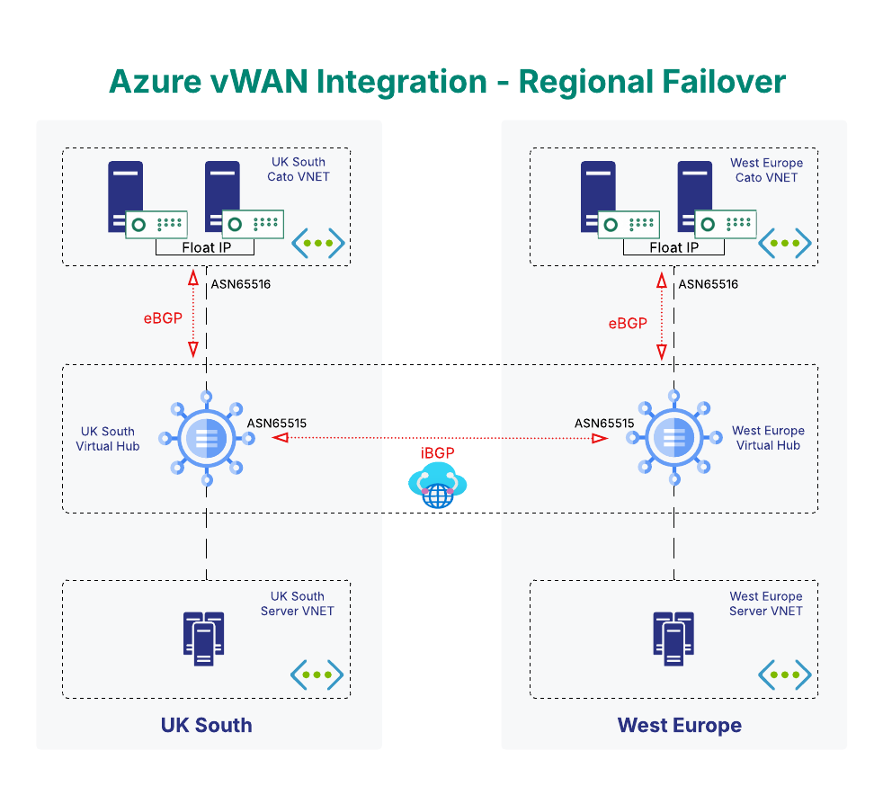

# Cato VSocket Azure vWAN Terraform Module

[](https://registry.terraform.io/modules/catonetworks/azure-vwan-vsocket-ha/cato/latest)
[](https://opensource.org/licenses/Apache-2.0)
[](https://terraform.io)

Terraform module which deploys Cato Networks Sockets to Azure and integrates to a new or existing Azure Virtual WAN.

## Table of Contents

- [Overview](#overview)
- [Prerequisites](#prerequisites)
- [Quick Start](#quick-start)
- [Important Notes & Limitations](#important-notes--limitations)
- [Troubleshooting](#troubleshooting)
- [Security Best Practices](#security-best-practices)
- [Usage](#usage)
  - [Scenario 1: New vWAN, New vHubs, New Sockets](#scenario-1-new-vwan-new-vhubs-new-sockets)
  - [Scenario 2: Existing vWAN, New vHubs, New Sockets](#scenario-2-existing-vwan-new-vhubs-new-sockets)
  - [Scenario 3: Existing vWAN, Existing vHubs, New Sockets](#scenario-3-existing-vwan-existing-vhubs-new-sockets)
- [Site Location Reference](#site-location-reference)
- [Version Compatibility](#version-compatibility)
- [Requirements](#requirements)
- [Inputs](#inputs)
- [Outputs](#outputs)

## Overview

This module deploys Cato Networks vSockets in Azure with High Availability (HA) configuration integrated into Azure Virtual WAN infrastructure. It supports both greenfield and brownfield deployments, automatically handling BGP peering, network routing, and failover scenarios.

### Features

- **High Availability**: Primary/secondary vSocket pair with automatic failover
- **Multi-Regional Support**: Deploy across multiple Azure regions simultaneously
- **Flexible Infrastructure**: Works with new or existing vWAN and hubs
- **BGP Integration**: Automatic peering with Azure Virtual Hub Route Server
- **Network Automation**: Configures NSGs, UDRs, and subnet routing
- **Dynamic Site Location**: Auto-derives Cato site location from Azure region

## NOTE

- This module will look up the Cato Site Location information based on the Location of Azure specified.
- For help with finding exact syntax to match site location for city, state_name, country_name and timezone, please refer to the [cato_siteLocation data source](https://registry.terraform.io/providers/catonetworks/cato/latest/docs/data-sources/siteLocation).
- For help with finding a license id to assign, please refer to the [cato_licensingInfo data source](https://registry.terraform.io/providers/catonetworks/cato/latest/docs/data-sources/licensingInfo).
- For Translated Ranges, "Enable Static Range Translation" must be enabled. For more information please refer to [Configuring System Settings for the Account](https://support.catonetworks.com/hc/en-us/articles/4413280536849-Configuring-System-Settings-for-the-Account)

## Prerequisites

Before using this module, ensure you have:

- **Azure Subscription**: Active Azure subscription with appropriate permissions
- **Cato Account**: Commercial Cato Networks account (not trial) with API access
- **Terraform**: Version >= 1.5.0 installed
- **Azure CLI**: Installed and authenticated (`az login`)
- **Required Permissions**:
  - Azure: Contributor role on subscription or resource group
  - Cato: API token with Edit permissions

### Azure Regions Support

This module supports all major Azure regions. For the complete list of supported regions, see the `primary_location` and `regional_config.location` validation in [variables.tf](variables.tf).

## Quick Start

1. **Obtain Cato API credentials:**

   ```bash
   export TF_VAR_cato_token="your-api-token"
   export TF_VAR_cato_account_id="your-account-id"
   ```

2. **Create a minimal configuration:**
   See Scenario 1 below for a complete example

3. **Deploy:**

   ```bash
   terraform init
   terraform plan
   terraform apply -parallelism=1
   ```

## Important Notes & Limitations

### BGP Configuration

- Azure vWAN hubs use fixed ASN 65515 (Microsoft reserved)
- Your Cato BGP ASN must be in private range (64512-65534) and != 65515
- Different ASN values recommended for each scenario to avoid conflicts

### Network Requirements

- All CIDR ranges must be non-overlapping across regions
- Minimum subnet sizes: Management /28, WAN /28, LAN /29
- Hub address prefixes should be unique across regions

### Licensing

- Commercial Cato accounts only (trial accounts not supported)
- License assignment is optional but recommended for production
- Pooled licenses require bandwidth specification

### High Availability

- Primary and secondary vSockets deployed in availability sets
- Floating IP configuration for failover scenarios
- Health monitoring and automatic failover capabilities

## Troubleshooting

### Common Issues

**BGP Peering Issues:**

- Verify ASN values don't conflict with Azure's 65515
- Check hub routing preference settings
- Ensure network ranges don't overlap

**Authentication Issues:**

- Verify Cato API token has correct permissions
- Check Azure subscription permissions
- Ensure account ID format is correct (4-10 digits)

**Resource Naming:**

- Prefix must be 2-24 characters, alphanumeric with hyphens
- Resource group names must follow Azure naming conventions

### Debug Commands

```bash
# Check Cato site registration
catocli query accountSnapshotSite

# Verify Azure resources
az network vhub list --resource-group <rg-name>
az network vwan list --resource-group <rg-name>
```

## Security Best Practices

### Sensitive Variables

The module handles sensitive credentials securely:

```hcl
# Use environment variables (recommended)
export TF_VAR_cato_token="your-api-token"
export TF_VAR_cato_account_id="your-account-id"

# Or use terraform.tfvars (ensure it's in .gitignore)
cato_token     = "your-api-token"
cato_account_id = "your-account-id"
```

### Azure Authentication

Use Azure Service Principal or Managed Identity instead of personal credentials:

```bash
# Service Principal (for CI/CD)
export ARM_CLIENT_ID="your-client-id"
export ARM_CLIENT_SECRET="your-client-secret"
export ARM_SUBSCRIPTION_ID="your-subscription-id"
export ARM_TENANT_ID="your-tenant-id"

# Or use Azure CLI authentication (for local development)
az login
```

### State Management

- Use remote backend with encryption (Azure Storage, AWS S3, etc.)
- Enable state locking to prevent concurrent modifications
- Restrict access to state files containing sensitive data

```hcl
terraform {
  backend "azurerm" {
    resource_group_name  = "terraform-state-rg"
    storage_account_name = "terraformstate"
    container_name       = "tfstate"
    key                  = "cato-vwan.terraform.tfstate"
  }
}
```

## Usage

### Scenario 1: New vWAN, New vHubs, New Sockets

```hcl
# ===============================================================================
# SCENARIO 1: NEW vWAN DEPLOYMENT
# 
# This configuration demonstrates deploying Cato vSockets across multiple regions
# with a brand new Virtual WAN infrastructure created from scratch.
#
# Use Case: Greenfield deployment where no existing vWAN infrastructure exists
#
# REQUIRED: Update the authentication variables below with your actual values
# ===============================================================================

terraform {
  required_version = ">= 1.5.0"
  required_providers {
    azurerm = {
      source  = "hashicorp/azurerm"
      version = ">= 4.31.0"
    }
    cato = {
      source  = "catonetworks/cato"
      version = ">= 0.0.42"
    }
  }
}

variable "cato_token" {}
variable "cato_account_id" {}
variable "azure_subscription_id" {
  default = "Your-Subscription-ID-here"
}
variable "baseurl" {}


# Configure providers
provider "azurerm" {
  features {}
  subscription_id = var.azure_subscription_id
}

provider "cato" {
  baseurl    = var.baseurl
  token      = var.cato_token
  account_id = var.cato_account_id
}

# Call the multi-regional module with NEW vWAN configuration
module "cato_multiregional_new_vwan" {
  source = "catonetworks/azure-vwan-vsocket-ha/cato""

  # Global Configuration
  prefix                = "Your-Naming-Prefix-here"
  primary_location      = "Your-primary-region-here"
  create_resource_group = true
  resource_group_name   = "Your-resource-group-name-here"


  # NEW vWAN Configuration - Creates fresh Virtual WAN
  create_vwan = true # This creates a NEW vWAN
  # existing_vwan_name is not specified, so a new one will be created

  # Authentication
  baseurl               = var.baseurl
  cato_token            = var.cato_token
  cato_account_id       = var.cato_account_id
  azure_subscription_id = var.azure_subscription_id

  # BGP Configuration
  # IMPORTANT: Azure vWAN hubs always use ASN 65515 (Microsoft fixed)
  # Your Cato ASN must be different to avoid conflicts
  cato_bgp_asn = 65001 # Private ASN: 64512-65534 (not 65515)

  cato_bgp_peer_config = {
    primary = {
      metric                   = 100
      default_action           = "ACCEPT"
      advertise_all_routes     = true
      advertise_default_route  = true
      advertise_summary_routes = false
      bfd_enabled              = false
    }
    secondary = {
      metric                   = 200
      default_action           = "ACCEPT"
      advertise_all_routes     = true
      advertise_default_route  = true
      advertise_summary_routes = false
      bfd_enabled              = false
    }
  }

  # Multi-Regional Configuration for NEW vWAN
  regional_config = {
    "eastus2" = { #Your Region shortname
      location         = "Your Region Name e.g. East US 2"
      site_name        = "Your Site-Name here"
      site_description = "Your Site-Description here"
      site_type        = "CLOUD_DC"

      # Network Configuration
      native_network_range = "10.1.0.0/16" #CIDR for the Socket Native Range
      vnet_network_range   = "10.1.0.0/16" #CIDR for the vNET Network
      subnet_range_mgmt    = "10.1.1.0/24" #CIDR for the Socket Management Network
      subnet_range_wan     = "10.1.2.0/24" #CIDR for the WAN Network 
      subnet_range_lan     = "10.1.3.0/24" #CIDR for the LAN Network

      # HA Configuration
      floating_ip      = "10.1.3.10" # Socket Floating IP - Should be in the LAN Subnet
      lan_ip_primary   = "10.1.3.11" # Primary Socket IP - Should be in the LAN Subnet
      lan_ip_secondary = "10.1.3.12" # Secondary Socket IP - Should be in the LAN Subnet

      # VM Configuration
      vm_size = "Standard_D8ls_v5" # VM Size

      # Site Location (auto-derived from Azure region) #Site Location is derived from the Azure Region, Can be overridden below.
      site_location = {
        city         = null
        country_code = null
        state_code   = null
        timezone     = null
      }

      # Hub Configuration - CREATES NEW HUB
      create_hub             = true #Create New Hubs
      hub_address_prefix     = "10.101.0.0/24" #HUB CIDR
      hub_routing_preference = "ASPath" #HUB Routing Preference
    }

    "westus2" = { #Your next region shortname
      location         = "Your Region Name e.g. West US 2"
      site_name        = "Your Site-Name here"
      site_description = "Your Site-Description here"
      site_type        = "CLOUD_DC"

      # Network Configuration (different ranges to avoid conflicts)
      native_network_range = "10.2.0.0/16" #CIDR for the Socket Native Range
      vnet_network_range   = "10.2.0.0/16" #CIDR for the vNET Network
      subnet_range_mgmt    = "10.2.1.0/24" #CIDR for the Socket Management Network
      subnet_range_wan     = "10.2.2.0/24" #CIDR for the WAN Network
      subnet_range_lan     = "10.2.3.0/24" #CIDR for the LAN Network

      # HA Configuration
      floating_ip      = "10.2.3.10" # Socket Floating IP - Should be in the LAN Subnet
      lan_ip_primary   = "10.2.3.11" # Primary Socket IP - Should be in the LAN Subnet
      lan_ip_secondary = "10.2.3.12" # Secondary Socket IP - Should be in the LAN Subnet

      # VM Configuration
      vm_size = "Standard_D8ls_v5" # VM Size

      # Site Location (auto-derived from Azure region) #Site Location is derived from the Azure Region, Can be overridden Below.
      site_location = {
        city         = null
        country_code = null
        state_code   = null
        timezone     = null
      }

      # Hub Configuration - CREATES NEW HUB
      create_hub             = true #Create New Hubs
      hub_address_prefix     = "10.102.0.0/24" #HUB CIDR
      hub_routing_preference = "ASPath" #HUB Routing Preference
    }
  }

  # Tags applied to all resources
  tags = {
    Environment = "testing"
    Scenario    = "new-vwan"
    Project     = "cato-multi-regional-test"
    Purpose     = "validation"
    CreatedBy   = "terraform"
    TestType    = "new-vwan-scenario"
  }
}

```

### Scenario 2: Existing vWAN, New vHubs, New Sockets

```hcl
# ===============================================================================
# SCENARIO 2: EXISTING vWAN DEPLOYMENT
# 
# This configuration demonstrates deploying Cato vSockets across multiple regions
# using an EXISTING Virtual WAN infrastructure, adding new regional hubs.
#
# Use Case: Brownfield deployment where existing vWAN infrastructure is present
#           and you want to extend it with Cato connectivity
#
# REQUIRED: Update the authentication variables and existing resource names below
# ===============================================================================

terraform {
  required_version = ">= 1.5.0"
  required_providers {
    azurerm = {
      source  = "hashicorp/azurerm"
      version = ">= 4.31.0"
    }
    cato = {
      source  = "catonetworks/cato"
      version = ">= 0.0.42"
    }
  }
}

# Authentication Variables and Existing Resources - UPDATE THESE WITH YOUR ACTUAL VALUES
locals {
  # REQUIRED: Update with your existing Azure resource names
  existing_resource_group_name = "Your-existing-resource-group"   # UPDATE WITH YOUR ACTUAL RG NAME
  existing_vwan_name           = "Your-existing-vwan-name" # UPDATE WITH YOUR ACTUAL vWAN NAME
}

variable "cato_token" {}
variable "cato_account_id" {}
variable "azure_subscription_id" {
  default = "Your-Subscription-ID-here"
}
variable "baseurl" {}

# Configure providers
provider "azurerm" {
  features {}
  subscription_id = var.azure_subscription_id
}

provider "cato" {
  baseurl    = var.baseurl
  token      = var.cato_token
  account_id = var.cato_account_id
}

# Call the multi-regional module with EXISTING vWAN configuration
module "cato_multiregional_existing_vwan" {
  source = "catonetworks/azure-vwan-vsocket-ha/cato"

  # Global Configuration
  prefix                = "Your-Naming-Prefix-here"
  primary_location      = "Your-primary-region-here" # Should match where your existing vWAN is located
  create_resource_group = false       # Use existing resource group
  resource_group_name   = local.existing_resource_group_name

  # EXISTING vWAN Configuration - Uses pre-existing Virtual WAN
  create_vwan        = false                    # This uses an EXISTING vWAN
  existing_vwan_name = local.existing_vwan_name # Name of existing vWAN

  # For existing resource group scenario
  existing_resource_group_name = local.existing_resource_group_name

  # Authentication
  baseurl               = var.baseurl
  cato_token            = var.cato_token
  cato_account_id       = var.cato_account_id
  azure_subscription_id = var.azure_subscription_id

  # BGP Configuration 
  # IMPORTANT: Azure vWAN hubs always use ASN 65515 (Microsoft fixed)
  # Use different ASN to avoid conflicts with new vWAN scenario and Azure
  cato_bgp_asn = 65002 # Private ASN: 64512-65534 (not 65515)

  cato_bgp_peer_config = {
    primary = {
      metric                   = 100
      default_action           = "ACCEPT"
      advertise_all_routes     = true
      advertise_default_route  = true
      advertise_summary_routes = false
      bfd_enabled              = false
    }
    secondary = {
      metric                   = 200
      default_action           = "ACCEPT"
      advertise_all_routes     = true
      advertise_default_route  = true
      advertise_summary_routes = false
      bfd_enabled              = false
    }
  }

  # Multi-Regional Configuration for EXISTING vWAN
  # These regions will have new hubs created in your existing vWAN
  regional_config = {
    "centralus" = { #Your Region Shortname
      location         = "Central US"
      site_name        = "Your-Site-Name-here-Central-US"
      site_description = "Your-Site-Description-here"
      site_type        = "CLOUD_DC"

      # Network Configuration (different ranges from new vWAN scenario)
      native_network_range = "10.3.0.0/16" #CIDR for the Socket Native Range
      vnet_network_range   = "10.3.0.0/16" #CIDR for the vNET Network
      subnet_range_mgmt    = "10.3.1.0/24" #CIDR for the Socket Management Network
      subnet_range_wan     = "10.3.2.0/24" #CIDR for the WAN Network
      subnet_range_lan     = "10.3.3.0/24" #CIDR for the LAN Network

      # HA Configuration
      floating_ip      = "10.3.3.10" # Socket Floating IP - Should be in the LAN Subnet
      lan_ip_primary   = "10.3.3.11" # Primary Socket IP - Should be in the LAN Subnet
      lan_ip_secondary = "10.3.3.12" # Secondary Socket IP - Should be in the LAN Subnet

      # VM Configuration
      vm_size = "Standard_D8ls_v5" # VM Size

      # Site Location (auto-derived from Azure region) #Site Location is derived from the Azure Region, Can be overridden Below.
      site_location = {
        city         = null
        country_code = null
        state_code   = null
        timezone     = null
      }

      # Hub Configuration - CREATES NEW HUB IN EXISTING vWAN
      create_hub             = true #Create New Hubs in existing vWAN
      hub_address_prefix     = "10.103.0.0/24" #HUB CIDR
      hub_routing_preference = "ASPath" #HUB Routing Preference
    }

    "scentralus" = { #Your Region Shortname
      location         = "South Central US"
      site_name        = "Your-Site-Name-here-South-Central-US"
      site_description = "Your-Site-Description-here"
      site_type        = "CLOUD_DC"

      # Network Configuration (different ranges to avoid conflicts)
      native_network_range = "10.4.0.0/16" #CIDR for the Socket Native Range
      vnet_network_range   = "10.4.0.0/16" #CIDR for the vNET Network
      subnet_range_mgmt    = "10.4.1.0/24" #CIDR for the Socket Management Network
      subnet_range_wan     = "10.4.2.0/24" #CIDR for the WAN Network
      subnet_range_lan     = "10.4.3.0/24" #CIDR for the LAN Network

      # HA Configuration
      floating_ip      = "10.4.3.10" # Socket Floating IP - Should be in the LAN Subnet
      lan_ip_primary   = "10.4.3.11" # Primary Socket IP - Should be in the LAN Subnet
      lan_ip_secondary = "10.4.3.12" # Secondary Socket IP - Should be in the LAN Subnet

      # VM Configuration
      vm_size = "Standard_D8ls_v5" # VM Size

      # Site Location (auto-derived from Azure region) #Site Location is derived from the Azure Region, Can be overridden Below.
      site_location = {
        city         = null
        country_code = null
        state_code   = null
        timezone     = null
      }

      # Hub Configuration - CREATES NEW HUB IN EXISTING vWAN
      create_hub             = true #Create New Hubs in existing vWAN
      hub_address_prefix     = "10.104.0.0/24" #HUB CIDR
      hub_routing_preference = "ASPath" #HUB Routing Preference
    }
  }

  # Tags applied to all resources
  tags = {
    Environment = "testing"
    Scenario    = "existing-vwan"
    Project     = "cato-multi-regional-test"
    Purpose     = "validation"
    CreatedBy   = "terraform"
    TestType    = "existing-vwan-scenario"
  }
}

```

### Scenario 3: Existing vWAN, Existing vHubs, New Sockets

```hcl
# ===============================================================================
# SCENARIO 3: EXISTING vWAN + EXISTING HUBS DEPLOYMENT
# 
# This configuration demonstrates deploying Cato vSockets across multiple regions
# using EXISTING Virtual WAN infrastructure with EXISTING regional hubs.
#
# Use Case: Most common enterprise brownfield deployment where complete vWAN 
#           infrastructure already exists and you're adding Cato connectivity
#           to existing hubs without creating any new vWAN infrastructure.
#
# REQUIRED: Update authentication variables and ALL existing resource names below
# ===============================================================================

terraform {
  required_version = ">= 1.5.0"
  required_providers {
    azurerm = {
      source  = "hashicorp/azurerm"
      version = ">= 4.31.0"
    }
    cato = {
      source  = "catonetworks/cato"
      version = ">= 0.0.42"
    }
  }
}

# Authentication Variables and Existing Resources - UPDATE THESE WITH YOUR ACTUAL VALUES
locals {
  # REQUIRED: Update with your existing Azure resource names
  existing_resource_group_name = "Your-existing-resource-group"   # UPDATE WITH YOUR ACTUAL RG NAME
  existing_vwan_name           = "Your-existing-vwan-name"        # UPDATE WITH YOUR ACTUAL vWAN NAME
  existing_northeurope_hub     = "Your-existing-hub-name-ne"     # UPDATE WITH YOUR ACTUAL HUB NAME 
  existing_westeurope_hub      = "Your-existing-hub-name-we"     # UPDATE WITH YOUR ACTUAL HUB NAME
  existing_japaneast_hub       = "Your-existing-hub-name-jp"     # UPDATE WITH YOUR ACTUAL HUB NAME
}

variable "cato_token" {}
variable "cato_account_id" {}
variable "azure_subscription_id" {
  default = "Your-Subscription-ID-here"
}
variable "baseurl" {}

# Configure providers
provider "azurerm" {
  features {}
  subscription_id = var.azure_subscription_id
}

provider "cato" {
  baseurl    = var.baseurl
  token      = var.cato_token
  account_id = var.cato_account_id
}

# Call the multi-regional module with EXISTING vWAN + EXISTING HUBS configuration
module "cato_multiregional_existing_infrastructure" {
  source = "catonetworks/azure-vwan-vsocket-ha/cato"

  # Global Configuration
  prefix                = "Your-Naming-Prefix-here"
  primary_location      = "Your-primary-region-here" # Should match where your existing vWAN is located
  create_resource_group = false       # Use existing resource group
  resource_group_name   = local.existing_resource_group_name

  # EXISTING vWAN Configuration - Uses pre-existing Virtual WAN
  create_vwan        = false                    # This uses an EXISTING vWAN
  existing_vwan_name = local.existing_vwan_name # Name of existing vWAN

  # EXISTING Resource Group Configuration - Uses pre-existing RG
  existing_resource_group_name = local.existing_resource_group_name

  # Authentication
  baseurl               = var.baseurl
  cato_token            = var.cato_token
  cato_account_id       = var.cato_account_id
  azure_subscription_id = var.azure_subscription_id

  # BGP Configuration 
  # IMPORTANT: Azure vWAN hubs always use ASN 65515 (Microsoft fixed)
  # Use different ASN to avoid conflicts with other scenarios and Azure
  cato_bgp_asn = 65003 # Private ASN: 64512-65534 (not 65515)

  cato_bgp_peer_config = {
    primary = {
      metric                   = 100
      default_action           = "ACCEPT"
      advertise_all_routes     = true
      advertise_default_route  = true
      advertise_summary_routes = false
      bfd_enabled              = false
    }
    secondary = {
      metric                   = 200
      default_action           = "ACCEPT"
      advertise_all_routes     = true
      advertise_default_route  = true
      advertise_summary_routes = false
      bfd_enabled              = false
    }
  }

  # Multi-Regional Configuration for EXISTING vWAN + EXISTING HUBS
  # These regions must have existing hubs already deployed in your vWAN
  regional_config = {
    "northeurope" = { #Your Region Shortname
      location         = "Your Location here"
      site_name        = "Your-Site-Name-here-North-Europe"
      site_description = "Your-Site-Description-here"
      site_type        = "CLOUD_DC"
    
      # Network Configuration (different ranges from other scenarios)
      native_network_range = "10.5.0.0/16" #CIDR for the Socket Native Range
      vnet_network_range   = "10.5.0.0/16" #CIDR for the vNET Network
      subnet_range_mgmt    = "10.5.1.0/24" #CIDR for the Socket Management Network
      subnet_range_wan     = "10.5.2.0/24" #CIDR for the WAN Network
      subnet_range_lan     = "10.5.3.0/24" #CIDR for the LAN Network
    
      # HA Configuration
      floating_ip      = "10.5.3.10" # Socket Floating IP - Should be in the LAN Subnet
      lan_ip_primary   = "10.5.3.11" # Primary Socket IP - Should be in the LAN Subnet
      lan_ip_secondary = "10.5.3.12" # Secondary Socket IP - Should be in the LAN Subnet
    
      # VM Configuration
      vm_size = "Standard_D8ls_v5" # VM Size
    
      # Site Location (auto-derived from Azure region) #Site Location is derived from the Azure Region, Can be overridden Below.
      site_location = {
        city         = null
        country_code = null
        state_code   = null
        timezone     = null
      }
    
      # Hub Configuration - USES EXISTING HUB
      create_hub        = false                          # DO NOT create new hub
      existing_hub_name = local.existing_northeurope_hub # UPDATE WITH YOUR ACTUAL HUB NAME
    }

    "westeurope" = { #Your Region Shortname
      location         = "Your Region Here"
      site_name        = "Your-Site-Name-here-West-Europe"
      site_description = "Your-Site-Description-here"
      site_type        = "CLOUD_DC"

      # Network Configuration (different ranges to avoid conflicts)
      native_network_range = "10.6.0.0/16" #CIDR for the Socket Native Range
      vnet_network_range   = "10.6.0.0/16" #CIDR for the vNET Network
      subnet_range_mgmt    = "10.6.1.0/24" #CIDR for the Socket Management Network
      subnet_range_wan     = "10.6.2.0/24" #CIDR for the WAN Network
      subnet_range_lan     = "10.6.3.0/24" #CIDR for the LAN Network

      # HA Configuration
      floating_ip      = "10.6.3.10" # Socket Floating IP - Should be in the LAN Subnet
      lan_ip_primary   = "10.6.3.11" # Primary Socket IP - Should be in the LAN Subnet
      lan_ip_secondary = "10.6.3.12" # Secondary Socket IP - Should be in the LAN Subnet

      # VM Configuration
      vm_size = "Standard_D8ls_v5" # VM Size

      # Site Location (auto-derived from Azure region) #Site Location is derived from the Azure Region, Can be overridden Below.
      site_location = {
        city         = null
        country_code = null
        state_code   = null
        timezone     = null
      }

      # Hub Configuration - USES EXISTING HUB
      create_hub        = false                         # DO NOT create new hub
      existing_hub_name = local.existing_westeurope_hub # UPDATE WITH YOUR ACTUAL HUB NAME
    }

    "japaneast" = { #Your Region Shortname
      location         = "Your Region Here"
      site_name        = "Your-Site-Name-here-Japan-East"
      site_description = "Your-Site-Description-here"
      site_type        = "CLOUD_DC"

      # Network Configuration (APAC ranges)
      native_network_range = "10.7.0.0/16" #CIDR for the Socket Native Range
      vnet_network_range   = "10.7.0.0/16" #CIDR for the vNET Network
      subnet_range_mgmt    = "10.7.1.0/24" #CIDR for the Socket Management Network
      subnet_range_wan     = "10.7.2.0/24" #CIDR for the WAN Network
      subnet_range_lan     = "10.7.3.0/24" #CIDR for the LAN Network

      # HA Configuration
      floating_ip      = "10.7.3.10" # Socket Floating IP - Should be in the LAN Subnet
      lan_ip_primary   = "10.7.3.11" # Primary Socket IP - Should be in the LAN Subnet
      lan_ip_secondary = "10.7.3.12" # Secondary Socket IP - Should be in the LAN Subnet

      # VM Configuration
      vm_size = "Standard_D8ls_v5" # VM Size

      # Site Location (auto-derived from Azure region) #Site Location is derived from the Azure Region, Can be overridden Below.
      site_location = {
        city         = null
        country_code = null
        state_code   = null
        timezone     = null
      }

      # Hub Configuration - USES EXISTING HUB
      create_hub        = false                        # DO NOT create new hub
      existing_hub_name = local.existing_japaneast_hub # UPDATE WITH YOUR ACTUAL HUB NAME
    }
  }

  # Tags applied to all resources
  tags = {
    Environment = "testing"
    Scenario    = "existing-vwan-existing-hubs"
    Project     = "cato-multi-regional-test"
    Purpose     = "validation"
    CreatedBy   = "terraform"
    TestType    = "existing-infrastructure-scenario"
  }
}

```

## Site Location Reference

For more information on site_location syntax, use the [Cato CLI](https://github.com/catonetworks/cato-cli) to lookup values.

```bash
$ pip3 install catocli
$ export CATO_TOKEN="your-api-token-here"
$ export CATO_ACCOUNT_ID="your-account-id"
$ catocli query siteLocation -h
$ catocli query siteLocation '{"filters":[{"search": "San Diego","field":"city","operation":"exact"}]}' -p
```

## Architecture

The module creates a highly available Cato vSocket deployment integrated with Azure Virtual WAN:

### Key Architecture Components

- **Azure Virtual WAN**: Centralized hub-and-spoke networking
- **vSocket HA Pairs**: Primary/secondary VMs with floating IP failover
- **BGP Peering**: Dynamic routing between vSockets and vWAN hubs
- **Network Security**: NSGs controlling traffic flow
- **User Defined Routes**: Custom routing for optimal traffic flow
- **Multi-Regional**: Deploy across multiple Azure regions

#### Static Architecture Diagram



## Version Compatibility

| Module Version | Terraform | Azure Provider | Cato Provider |
|---------------|-----------|----------------|---------------|
| 0.0.1+        | >= 1.5.0  | >= 4.31.0      | >= 0.0.42     |

## Authors

Module is maintained by [Cato Networks](https://github.com/catonetworks) with help from [these awesome contributors](https://github.com/catonetworks/terraform-cato-azure-vwan-vsocket-ha/graphs/contributors).

## License

Apache 2 Licensed. See [LICENSE](https://github.com/catonetworks/terraform-cato-azure-vwan-vsocket-ha/tree/master/LICENSE) for full details.

<!-- BEGIN_TF_DOCS -->
## Requirements

| Name | Version |
|------|---------|
| <a name="requirement_terraform"></a> [terraform](#requirement\_terraform) | >= 1.5 |
| <a name="requirement_azurerm"></a> [azurerm](#requirement\_azurerm) | >=4.31.0 |
| <a name="requirement_cato"></a> [cato](#requirement\_cato) | >= 0.0.42 |

## Providers

| Name | Version |
|------|---------|
| <a name="provider_azurerm"></a> [azurerm](#provider\_azurerm) | >=4.31.0 |
| <a name="provider_cato"></a> [cato](#provider\_cato) | >= 0.0.42 |
| <a name="provider_null"></a> [null](#provider\_null) | n/a |
| <a name="provider_random"></a> [random](#provider\_random) | n/a |
| <a name="provider_time"></a> [time](#provider\_time) | n/a |

## Modules

No modules.

## Resources

| Name | Type |
|------|------|
| [azurerm_availability_set.availability-set](https://registry.terraform.io/providers/hashicorp/azurerm/latest/docs/resources/availability_set) | resource |
| [azurerm_linux_virtual_machine.vsocket_primary](https://registry.terraform.io/providers/hashicorp/azurerm/latest/docs/resources/linux_virtual_machine) | resource |
| [azurerm_linux_virtual_machine.vsocket_secondary](https://registry.terraform.io/providers/hashicorp/azurerm/latest/docs/resources/linux_virtual_machine) | resource |
| [azurerm_network_interface.lan-nic-primary](https://registry.terraform.io/providers/hashicorp/azurerm/latest/docs/resources/network_interface) | resource |
| [azurerm_network_interface.lan-nic-secondary](https://registry.terraform.io/providers/hashicorp/azurerm/latest/docs/resources/network_interface) | resource |
| [azurerm_network_interface.mgmt-nic-primary](https://registry.terraform.io/providers/hashicorp/azurerm/latest/docs/resources/network_interface) | resource |
| [azurerm_network_interface.mgmt-nic-secondary](https://registry.terraform.io/providers/hashicorp/azurerm/latest/docs/resources/network_interface) | resource |
| [azurerm_network_interface.wan-nic-primary](https://registry.terraform.io/providers/hashicorp/azurerm/latest/docs/resources/network_interface) | resource |
| [azurerm_network_interface.wan-nic-secondary](https://registry.terraform.io/providers/hashicorp/azurerm/latest/docs/resources/network_interface) | resource |
| [azurerm_network_security_group.lan-sg](https://registry.terraform.io/providers/hashicorp/azurerm/latest/docs/resources/network_security_group) | resource |
| [azurerm_network_security_group.mgmt-sg](https://registry.terraform.io/providers/hashicorp/azurerm/latest/docs/resources/network_security_group) | resource |
| [azurerm_network_security_group.wan-sg](https://registry.terraform.io/providers/hashicorp/azurerm/latest/docs/resources/network_security_group) | resource |
| [azurerm_public_ip.mgmt-public-ip-primary](https://registry.terraform.io/providers/hashicorp/azurerm/latest/docs/resources/public_ip) | resource |
| [azurerm_public_ip.mgmt-public-ip-secondary](https://registry.terraform.io/providers/hashicorp/azurerm/latest/docs/resources/public_ip) | resource |
| [azurerm_public_ip.wan-public-ip-primary](https://registry.terraform.io/providers/hashicorp/azurerm/latest/docs/resources/public_ip) | resource |
| [azurerm_public_ip.wan-public-ip-secondary](https://registry.terraform.io/providers/hashicorp/azurerm/latest/docs/resources/public_ip) | resource |
| [azurerm_resource_group.rg](https://registry.terraform.io/providers/hashicorp/azurerm/latest/docs/resources/resource_group) | resource |
| [azurerm_role_assignment.lan-subnet-role](https://registry.terraform.io/providers/hashicorp/azurerm/latest/docs/resources/role_assignment) | resource |
| [azurerm_role_assignment.primary_nic_ha_role](https://registry.terraform.io/providers/hashicorp/azurerm/latest/docs/resources/role_assignment) | resource |
| [azurerm_role_assignment.secondary_nic_ha_role](https://registry.terraform.io/providers/hashicorp/azurerm/latest/docs/resources/role_assignment) | resource |
| [azurerm_route.internet-route](https://registry.terraform.io/providers/hashicorp/azurerm/latest/docs/resources/route) | resource |
| [azurerm_route.lan-route](https://registry.terraform.io/providers/hashicorp/azurerm/latest/docs/resources/route) | resource |
| [azurerm_route.public-route-kms](https://registry.terraform.io/providers/hashicorp/azurerm/latest/docs/resources/route) | resource |
| [azurerm_route_table.private-rt](https://registry.terraform.io/providers/hashicorp/azurerm/latest/docs/resources/route_table) | resource |
| [azurerm_route_table.public-rt](https://registry.terraform.io/providers/hashicorp/azurerm/latest/docs/resources/route_table) | resource |
| [azurerm_subnet.subnet-lan](https://registry.terraform.io/providers/hashicorp/azurerm/latest/docs/resources/subnet) | resource |
| [azurerm_subnet.subnet-mgmt](https://registry.terraform.io/providers/hashicorp/azurerm/latest/docs/resources/subnet) | resource |
| [azurerm_subnet.subnet-wan](https://registry.terraform.io/providers/hashicorp/azurerm/latest/docs/resources/subnet) | resource |
| [azurerm_subnet_network_security_group_association.lan-association](https://registry.terraform.io/providers/hashicorp/azurerm/latest/docs/resources/subnet_network_security_group_association) | resource |
| [azurerm_subnet_network_security_group_association.mgmt-association](https://registry.terraform.io/providers/hashicorp/azurerm/latest/docs/resources/subnet_network_security_group_association) | resource |
| [azurerm_subnet_network_security_group_association.wan-association](https://registry.terraform.io/providers/hashicorp/azurerm/latest/docs/resources/subnet_network_security_group_association) | resource |
| [azurerm_subnet_route_table_association.rt-table-association-lan](https://registry.terraform.io/providers/hashicorp/azurerm/latest/docs/resources/subnet_route_table_association) | resource |
| [azurerm_subnet_route_table_association.rt-table-association-mgmt](https://registry.terraform.io/providers/hashicorp/azurerm/latest/docs/resources/subnet_route_table_association) | resource |
| [azurerm_subnet_route_table_association.rt-table-association-wan](https://registry.terraform.io/providers/hashicorp/azurerm/latest/docs/resources/subnet_route_table_association) | resource |
| [azurerm_user_assigned_identity.CatoHaIdentity](https://registry.terraform.io/providers/hashicorp/azurerm/latest/docs/resources/user_assigned_identity) | resource |
| [azurerm_virtual_hub.vhub_new](https://registry.terraform.io/providers/hashicorp/azurerm/latest/docs/resources/virtual_hub) | resource |
| [azurerm_virtual_hub_bgp_connection.nva_peering](https://registry.terraform.io/providers/hashicorp/azurerm/latest/docs/resources/virtual_hub_bgp_connection) | resource |
| [azurerm_virtual_hub_connection.hub_connection](https://registry.terraform.io/providers/hashicorp/azurerm/latest/docs/resources/virtual_hub_connection) | resource |
| [azurerm_virtual_machine_extension.vsocket-custom-script-primary](https://registry.terraform.io/providers/hashicorp/azurerm/latest/docs/resources/virtual_machine_extension) | resource |
| [azurerm_virtual_machine_extension.vsocket-custom-script-secondary](https://registry.terraform.io/providers/hashicorp/azurerm/latest/docs/resources/virtual_machine_extension) | resource |
| [azurerm_virtual_network.vnet](https://registry.terraform.io/providers/hashicorp/azurerm/latest/docs/resources/virtual_network) | resource |
| [azurerm_virtual_network_dns_servers.dns_servers](https://registry.terraform.io/providers/hashicorp/azurerm/latest/docs/resources/virtual_network_dns_servers) | resource |
| [azurerm_virtual_wan.vwan](https://registry.terraform.io/providers/hashicorp/azurerm/latest/docs/resources/virtual_wan) | resource |
| [cato_bgp_peer.vwan_peering](https://registry.terraform.io/providers/catonetworks/cato/latest/docs/resources/bgp_peer) | resource |
| [cato_license.license](https://registry.terraform.io/providers/catonetworks/cato/latest/docs/resources/license) | resource |
| [cato_network_range.hub_routed_range](https://registry.terraform.io/providers/catonetworks/cato/latest/docs/resources/network_range) | resource |
| [cato_network_range.routedAzure](https://registry.terraform.io/providers/catonetworks/cato/latest/docs/resources/network_range) | resource |
| [cato_socket_site.azure-site](https://registry.terraform.io/providers/catonetworks/cato/latest/docs/resources/socket_site) | resource |
| [null_resource.configure_secondary_azure_vsocket](https://registry.terraform.io/providers/hashicorp/null/latest/docs/resources/resource) | resource |
| [null_resource.delay](https://registry.terraform.io/providers/hashicorp/null/latest/docs/resources/resource) | resource |
| [null_resource.delay-600](https://registry.terraform.io/providers/hashicorp/null/latest/docs/resources/resource) | resource |
| [null_resource.reboot_vsocket_primary](https://registry.terraform.io/providers/hashicorp/null/latest/docs/resources/resource) | resource |
| [null_resource.reboot_vsocket_secondary](https://registry.terraform.io/providers/hashicorp/null/latest/docs/resources/resource) | resource |
| [null_resource.run_command_ha_primary](https://registry.terraform.io/providers/hashicorp/null/latest/docs/resources/resource) | resource |
| [null_resource.run_command_ha_secondary](https://registry.terraform.io/providers/hashicorp/null/latest/docs/resources/resource) | resource |
| [null_resource.sleep_30_seconds](https://registry.terraform.io/providers/hashicorp/null/latest/docs/resources/resource) | resource |
| [null_resource.sleep_before_delete](https://registry.terraform.io/providers/hashicorp/null/latest/docs/resources/resource) | resource |
| [random_string.vsocket-random-password](https://registry.terraform.io/providers/hashicorp/random/latest/docs/resources/string) | resource |
| [random_string.vsocket-random-username](https://registry.terraform.io/providers/hashicorp/random/latest/docs/resources/string) | resource |
| [time_sleep.sleep_5_seconds](https://registry.terraform.io/providers/hashicorp/time/latest/docs/resources/sleep) | resource |
| [time_sleep.sleep_5_seconds_secondary](https://registry.terraform.io/providers/hashicorp/time/latest/docs/resources/sleep) | resource |
| [azurerm_network_interface.lan-mac-primary](https://registry.terraform.io/providers/hashicorp/azurerm/latest/docs/data-sources/network_interface) | data source |
| [azurerm_network_interface.lan-mac-secondary](https://registry.terraform.io/providers/hashicorp/azurerm/latest/docs/data-sources/network_interface) | data source |
| [azurerm_network_interface.wan-mac-primary](https://registry.terraform.io/providers/hashicorp/azurerm/latest/docs/data-sources/network_interface) | data source |
| [azurerm_network_interface.wan-mac-secondary](https://registry.terraform.io/providers/hashicorp/azurerm/latest/docs/data-sources/network_interface) | data source |
| [azurerm_resource_group.existing_rg](https://registry.terraform.io/providers/hashicorp/azurerm/latest/docs/data-sources/resource_group) | data source |
| [azurerm_virtual_hub.vhub_existing](https://registry.terraform.io/providers/hashicorp/azurerm/latest/docs/data-sources/virtual_hub) | data source |
| [azurerm_virtual_network.cato_vnet](https://registry.terraform.io/providers/hashicorp/azurerm/latest/docs/data-sources/virtual_network) | data source |
| [azurerm_virtual_network.custom-vnet](https://registry.terraform.io/providers/hashicorp/azurerm/latest/docs/data-sources/virtual_network) | data source |
| [azurerm_virtual_wan.existing_vwan](https://registry.terraform.io/providers/hashicorp/azurerm/latest/docs/data-sources/virtual_wan) | data source |
| [cato_accountSnapshotSite.azure-site](https://registry.terraform.io/providers/catonetworks/cato/latest/docs/data-sources/accountSnapshotSite) | data source |
| [cato_accountSnapshotSite.azure-site-2](https://registry.terraform.io/providers/catonetworks/cato/latest/docs/data-sources/accountSnapshotSite) | data source |
| [cato_accountSnapshotSite.azure-site-secondary](https://registry.terraform.io/providers/catonetworks/cato/latest/docs/data-sources/accountSnapshotSite) | data source |
| [cato_siteLocation.site_location](https://registry.terraform.io/providers/catonetworks/cato/latest/docs/data-sources/siteLocation) | data source |

## Inputs

| Name | Description | Type | Default | Required |
|------|-------------|------|---------|:--------:|
| <a name="input_azure_subscription_id"></a> [azure\_subscription\_id](#input\_azure\_subscription\_id) | The Azure Subscription ID where resources will be deployed. | `string` | n/a | yes |
| <a name="input_baseurl"></a> [baseurl](#input\_baseurl) | Base URL for the Cato Networks API. | `string` | `"https://api.catonetworks.com/api/v1/graphql2"` | no |
| <a name="input_cato_account_id"></a> [cato\_account\_id](#input\_cato\_account\_id) | Your Cato Account ID. | `string` | n/a | yes |
| <a name="input_cato_bgp_asn"></a> [cato\_bgp\_asn](#input\_cato\_bgp\_asn) | The BGP Autonomous System Number for the Cato side of the peering. Must not conflict with Azure vWAN's fixed ASN 65515. | `number` | n/a | yes |
| <a name="input_cato_bgp_peer_config"></a> [cato\_bgp\_peer\_config](#input\_cato\_bgp\_peer\_config) | Configuration for the BGP peers. | <pre>map(object({<br/>    metric                   = number<br/>    default_action           = string<br/>    advertise_all_routes     = bool<br/>    advertise_default_route  = bool<br/>    advertise_summary_routes = bool<br/>    bfd_enabled              = optional(bool, false)<br/>  }))</pre> | <pre>{<br/>  "primary": {<br/>    "advertise_all_routes": true,<br/>    "advertise_default_route": true,<br/>    "advertise_summary_routes": false,<br/>    "bfd_enabled": false,<br/>    "default_action": "ACCEPT",<br/>    "metric": 100<br/>  },<br/>  "secondary": {<br/>    "advertise_all_routes": true,<br/>    "advertise_default_route": true,<br/>    "advertise_summary_routes": false,<br/>    "bfd_enabled": false,<br/>    "default_action": "ACCEPT",<br/>    "metric": 200<br/>  }<br/>}</pre> | no |
| <a name="input_cato_token"></a> [cato\_token](#input\_cato\_token) | Cato Management API Token. | `string` | n/a | yes |
| <a name="input_commands"></a> [commands](#input\_commands) | n/a | `list(string)` | <pre>[<br/>  "rm /cato/deviceid.txt",<br/>  "rm /cato/socket/configuration/socket_registration.json",<br/>  "nohup /cato/socket/run_socket_daemon.sh &"<br/>]</pre> | no |
| <a name="input_commands-secondary"></a> [commands-secondary](#input\_commands-secondary) | n/a | `list(string)` | <pre>[<br/>  "nohup /cato/socket/run_socket_daemon.sh &"<br/>]</pre> | no |
| <a name="input_create_resource_group"></a> [create\_resource\_group](#input\_create\_resource\_group) | Set to true to create a new resource group. If false, existing\_resource\_group\_name must be provided. | `bool` | `true` | no |
| <a name="input_create_vwan"></a> [create\_vwan](#input\_create\_vwan) | Set to true to create a new Virtual WAN. If false, existing\_vwan\_name must be provided. | `bool` | `true` | no |
| <a name="input_disk_size_gb"></a> [disk\_size\_gb](#input\_disk\_size\_gb) | Size of the managed disk in GB. | `number` | `8` | no |
| <a name="input_dns_servers"></a> [dns\_servers](#input\_dns\_servers) | n/a | `list(string)` | <pre>[<br/>  "168.63.129.16",<br/>  "10.254.254.1",<br/>  "1.1.1.1",<br/>  "8.8.8.8"<br/>]</pre> | no |
| <a name="input_enable_static_range_translation"></a> [enable\_static\_range\_translation](#input\_enable\_static\_range\_translation) | Enables the ability to use translated ranges | `string` | `false` | no |
| <a name="input_existing_resource_group_name"></a> [existing\_resource\_group\_name](#input\_existing\_resource\_group\_name) | The name of an existing resource group to use. Only used if create\_resource\_group is false. | `string` | `""` | no |
| <a name="input_existing_vwan_name"></a> [existing\_vwan\_name](#input\_existing\_vwan\_name) | The name of an existing Virtual WAN to use. Only used if create\_vwan is false. | `string` | `""` | no |
| <a name="input_floating_ip"></a> [floating\_ip](#input\_floating\_ip) | (DEPRECATED) The floating IP address used for High Availability (HA) failover. Use regional\_config instead. | `string` | `null` | no |
| <a name="input_image_reference_id"></a> [image\_reference\_id](#input\_image\_reference\_id) | The path to the image used to deploy a specific version of the virtual socket. | `string` | `"/Subscriptions/38b5ec1d-b3b6-4f50-a34e-f04a67121955/Providers/Microsoft.Compute/Locations/eastus/Publishers/catonetworks/ArtifactTypes/VMImage/Offers/cato_socket/Skus/public-cato-socket/Versions/19.0.17805"` | no |
| <a name="input_lan_ip_primary"></a> [lan\_ip\_primary](#input\_lan\_ip\_primary) | (DEPRECATED) Local IP Address of socket LAN interface. Use regional\_config instead. | `string` | `null` | no |
| <a name="input_lan_ip_secondary"></a> [lan\_ip\_secondary](#input\_lan\_ip\_secondary) | (DEPRECATED) Local IP Address of socket LAN interface. Use regional\_config instead. | `string` | `null` | no |
| <a name="input_lan_subnet_name"></a> [lan\_subnet\_name](#input\_lan\_subnet\_name) | (DEPRECATED) The name of the LAN subnet within the specified VNET. Use regional\_config instead. | `string` | `null` | no |
| <a name="input_license_bw"></a> [license\_bw](#input\_license\_bw) | The license bandwidth number for the cato site, specifying bandwidth ONLY applies for pooled licenses.  For a standard site license that is not pooled, leave this value null. Must be a number greater than 0 and an increment of 10. | `string` | `null` | no |
| <a name="input_license_id"></a> [license\_id](#input\_license\_id) | The license ID for the Cato vSocket of license type CATO\_SITE, CATO\_SSE\_SITE, CATO\_PB, CATO\_PB\_SSE.  Example License ID value: 'abcde123-abcd-1234-abcd-abcde1234567'.  Note that licenses are for commercial accounts, and not supported for trial accounts. | `string` | `null` | no |
| <a name="input_location"></a> [location](#input\_location) | (DEPRECATED) The Azure region where the resources should be deployed. Use regional\_config instead. | `string` | `null` | no |
| <a name="input_native_network_range"></a> [native\_network\_range](#input\_native\_network\_range) | (DEPRECATED) Choose a unique range for your Azure environment that does not conflict with the rest of your Wide Area Network.<br/>    The accepted input format is Standard CIDR Notation, e.g. X.X.X.X/X<br/>    Use regional\_config instead. | `string` | `null` | no |
| <a name="input_prefix"></a> [prefix](#input\_prefix) | A prefix to be used for naming all resources. | `string` | n/a | yes |
| <a name="input_primary_location"></a> [primary\_location](#input\_primary\_location) | The primary Azure region to deploy shared resources like the vWAN and Resource Group. | `string` | n/a | yes |
| <a name="input_regional_config"></a> [regional\_config](#input\_regional\_config) | A map containing specific configurations for each region. | <pre>map(object({<br/>    # --- Cato Module Inputs ---<br/>    location                        = string<br/>    native_network_range            = string<br/>    vnet_network_range              = string<br/>    subnet_range_mgmt               = string<br/>    subnet_range_wan                = string<br/>    subnet_range_lan                = string<br/>    lan_ip_primary                  = string<br/>    lan_ip_secondary                = string<br/>    floating_ip                     = string<br/>    site_name                       = string<br/>    site_description                = optional(string, "Multi-regional Cato vSocket site")<br/>    site_type                       = optional(string, "CLOUD_DC")<br/>    vnet_name                       = optional(string)                # If null, creates new VNET, otherwise uses existing<br/>    lan_subnet_name                 = optional(string, "subnet-lan")  # Used when vnet_name is specified<br/>    mgmt_subnet_name                = optional(string, "subnet-mgmt") # Used when vnet_name is specified<br/>    wan_subnet_name                 = optional(string, "subnet-wan")  # Used when vnet_name is specified<br/>    vm_size                         = optional(string, "Standard_D8ls_v5")<br/>    license_id                      = optional(string)<br/>    license_bw                      = optional(string)<br/>    dns_servers                     = optional(list(string), ["168.63.129.16", "10.254.254.1", "1.1.1.1", "8.8.8.8"])<br/>    enable_static_range_translation = optional(bool, false)<br/>    commands                        = optional(list(string), ["rm /cato/deviceid.txt", "rm /cato/socket/configuration/socket_registration.json", "nohup /cato/socket/run_socket_daemon.sh &"])<br/>    routed_networks = optional(map(object({<br/>      subnet            = string<br/>      translated_subnet = optional(string)<br/>      gateway           = optional(string)<br/>      interface_index   = optional(string, "LAN1")<br/>    })), {})<br/>    site_location = optional(object({<br/>      city         = optional(string)<br/>      country_code = optional(string)<br/>      state_code   = optional(string)<br/>      timezone     = optional(string)<br/>      }), {<br/>      city         = null<br/>      country_code = null<br/>      state_code   = null<br/>      timezone     = null<br/>    })<br/><br/>    # --- Hub Creation/Lookup ---<br/>    create_hub             = bool<br/>    existing_hub_name      = optional(string)<br/>    hub_address_prefix     = optional(string)<br/>    hub_routing_preference = optional(string, "ASPath") # ASPath (default), ExpressRoute, or VpnGateway<br/>  }))</pre> | n/a | yes |
| <a name="input_resource_group_name"></a> [resource\_group\_name](#input\_resource\_group\_name) | The name of the Azure Resource Group to create. Only used if create\_resource\_group is true. | `string` | `"cato-vwan-rg"` | no |
| <a name="input_routed_networks"></a> [routed\_networks](#input\_routed\_networks) | A map of routed networks to be accessed behind the vSocket site.<br/>  - The key is the logical name for the network.<br/>  - The value is an object containing:<br/>    - "subnet" (string, required): The actual CIDR range of the network.<br/>    - "translated\_subnet" (string, optional): The NATed CIDR range if translation is used.<br/>  Example: <br/>  routed\_networks = {<br/>    "Peered-VNET-1" = {<br/>      subnet = "10.100.1.0/24"<br/>    }<br/>    "On-Prem-Network-NAT" = {<br/>      subnet            = "192.168.51.0/24"<br/>      translated\_subnet = "10.200.1.0/24"<br/>    }<br/>  } | <pre>map(object({<br/>    subnet            = string<br/>    translated_subnet = optional(string)<br/>    gateway           = optional(string)<br/>    interface_index   = optional(string, "LAN1")<br/>  }))</pre> | `{}` | no |
| <a name="input_site_description"></a> [site\_description](#input\_site\_description) | (DEPRECATED) A brief description of the site for identification purposes. Use regional\_config instead. | `string` | `null` | no |
| <a name="input_site_location"></a> [site\_location](#input\_site\_location) | Site location which is used by the Cato Socket to connect to the closest Cato PoP. If not specified, the location will be derived from the Azure region dynamicaly. | <pre>object({<br/>    city         = string<br/>    country_code = string<br/>    state_code   = string<br/>    timezone     = string<br/>  })</pre> | <pre>{<br/>  "city": null,<br/>  "country_code": null,<br/>  "state_code": null,<br/>  "timezone": null<br/>}</pre> | no |
| <a name="input_site_name"></a> [site\_name](#input\_site\_name) | (DEPRECATED) The name of the Cato Networks site. Use regional\_config instead. | `string` | `null` | no |
| <a name="input_site_type"></a> [site\_type](#input\_site\_type) | (DEPRECATED) The type of the site (DATACENTER, BRANCH, CLOUD\_DC, HEADQUARTERS). Use regional\_config instead. | `string` | `null` | no |
| <a name="input_subnet_range_lan"></a> [subnet\_range\_lan](#input\_subnet\_range\_lan) | (DEPRECATED) Choose a range within the VPC to use as the Private/LAN subnet. Use regional\_config instead.<br/>    This subnet will host the target LAN interface of the vSocket so resources in the VPC (or AWS Region) can route to the Cato Cloud.<br/>    The minimum subnet length to support High Availability is /29.<br/>    The accepted input format is Standard CIDR Notation, e.g. X.X.X.X/X | `string` | `null` | no |
| <a name="input_subnet_range_mgmt"></a> [subnet\_range\_mgmt](#input\_subnet\_range\_mgmt) | (DEPRECATED) Choose a range within the VPC to use as the Management subnet. Use regional\_config instead.<br/>    This subnet will be used initially to access the public internet and register your vSocket to the Cato Cloud.<br/>    The minimum subnet length to support High Availability is /28.<br/>    The accepted input format is Standard CIDR Notation, e.g. X.X.X.X/X | `string` | `null` | no |
| <a name="input_subnet_range_wan"></a> [subnet\_range\_wan](#input\_subnet\_range\_wan) | (DEPRECATED) Choose a range within the VPC to use as the Public/WAN subnet. Use regional\_config instead.<br/>    This subnet will be used to access the public internet and securely tunnel to the Cato Cloud.<br/>    The minimum subnet length to support High Availability is /28.<br/>    The accepted input format is Standard CIDR Notation, e.g. X.X.X.X/X | `string` | `null` | no |
| <a name="input_tags"></a> [tags](#input\_tags) | A map of tags to apply to all resources. | `map(string)` | `{}` | no |
| <a name="input_vm_size"></a> [vm\_size](#input\_vm\_size) | (DEPRECATED) Specifies the size of the Virtual Machine. Use regional\_config instead. See Azure VM Naming Conventions: https://learn.microsoft.com/en-us/azure/virtual-machines/vm-naming-conventions | `string` | `null` | no |
| <a name="input_vnet_name"></a> [vnet\_name](#input\_vnet\_name) | (Optional) if a custom VNET ID is passed we will use the custom VNET, otherwise we will build one. | `any` | `null` | no |
| <a name="input_vnet_network_range"></a> [vnet\_network\_range](#input\_vnet\_network\_range) | (DEPRECATED) Choose a unique range for your new VPC that does not conflict with the rest of your Wide Area Network. Use regional\_config instead.<br/>    The accepted input format is Standard CIDR Notation, e.g. X.X.X.X/X | `string` | `null` | no |

## Outputs

| Name | Description |
|------|-------------|
| <a name="output_azure_bgp_connection_details"></a> [azure\_bgp\_connection\_details](#output\_azure\_bgp\_connection\_details) | Details of the BGP connections configured on the Azure Virtual Hub. |
| <a name="output_cato_bgp_peer_details"></a> [cato\_bgp\_peer\_details](#output\_cato\_bgp\_peer\_details) | Details of the configured Cato BGP peers. |
| <a name="output_cato_primary_serial"></a> [cato\_primary\_serial](#output\_cato\_primary\_serial) | Map of region to Primary Cato Socket Serial Number |
| <a name="output_cato_secondary_serial"></a> [cato\_secondary\_serial](#output\_cato\_secondary\_serial) | Map of region to Secondary Cato Socket Serial Number |
| <a name="output_cato_site_id"></a> [cato\_site\_id](#output\_cato\_site\_id) | Map of region to Cato Socket Site ID |
| <a name="output_cato_site_name"></a> [cato\_site\_name](#output\_cato\_site\_name) | Map of region to Cato Site Name |
| <a name="output_ha_identity_id"></a> [ha\_identity\_id](#output\_ha\_identity\_id) | Map of region to User Assigned Identity ID for HA |
| <a name="output_ha_identity_principal_id"></a> [ha\_identity\_principal\_id](#output\_ha\_identity\_principal\_id) | Map of region to Principal ID of the HA Identity |
| <a name="output_lan_nic_name_primary"></a> [lan\_nic\_name\_primary](#output\_lan\_nic\_name\_primary) | Map of region to primary LAN network interface name |
| <a name="output_lan_nic_name_secondary"></a> [lan\_nic\_name\_secondary](#output\_lan\_nic\_name\_secondary) | Map of region to secondary LAN network interface name for HA |
| <a name="output_lan_primary_nic_id"></a> [lan\_primary\_nic\_id](#output\_lan\_primary\_nic\_id) | Map of region to LAN Primary Network Interface ID |
| <a name="output_lan_secondary_mac_address"></a> [lan\_secondary\_mac\_address](#output\_lan\_secondary\_mac\_address) | Map of region to MAC Address of the Secondary LAN Interface |
| <a name="output_lan_secondary_nic_id"></a> [lan\_secondary\_nic\_id](#output\_lan\_secondary\_nic\_id) | Map of region to LAN Secondary Network Interface ID |
| <a name="output_lan_subnet_id"></a> [lan\_subnet\_id](#output\_lan\_subnet\_id) | Map of region to LAN subnet ID within the virtual network |
| <a name="output_lan_subnet_name"></a> [lan\_subnet\_name](#output\_lan\_subnet\_name) | Map of region to LAN subnet name within the virtual network |
| <a name="output_lan_subnet_role_assignment_id"></a> [lan\_subnet\_role\_assignment\_id](#output\_lan\_subnet\_role\_assignment\_id) | Map of region to Role Assignment ID for the LAN Subnet |
| <a name="output_mgmt_nic_name_primary"></a> [mgmt\_nic\_name\_primary](#output\_mgmt\_nic\_name\_primary) | Map of region to primary management network interface name |
| <a name="output_mgmt_nic_name_secondary"></a> [mgmt\_nic\_name\_secondary](#output\_mgmt\_nic\_name\_secondary) | Map of region to secondary management network interface name for HA |
| <a name="output_mgmt_primary_nic_id"></a> [mgmt\_primary\_nic\_id](#output\_mgmt\_primary\_nic\_id) | Map of region to Management Primary Network Interface ID |
| <a name="output_mgmt_secondary_nic_id"></a> [mgmt\_secondary\_nic\_id](#output\_mgmt\_secondary\_nic\_id) | Map of region to Management Secondary Network Interface ID |
| <a name="output_primary_nic_role_assignment_id"></a> [primary\_nic\_role\_assignment\_id](#output\_primary\_nic\_role\_assignment\_id) | Map of region to Role Assignment ID for the Primary NIC |
| <a name="output_regional_deployment_summary"></a> [regional\_deployment\_summary](#output\_regional\_deployment\_summary) | Comprehensive summary of all regional deployments with key identifiers |
| <a name="output_resource_group_name"></a> [resource\_group\_name](#output\_resource\_group\_name) | The name of the resource group used for the deployment |
| <a name="output_secondary_nic_role_assignment_id"></a> [secondary\_nic\_role\_assignment\_id](#output\_secondary\_nic\_role\_assignment\_id) | Map of region to Role Assignment ID for the Secondary NIC |
| <a name="output_site_location"></a> [site\_location](#output\_site\_location) | Regional site location data |
| <a name="output_virtual_hub_details"></a> [virtual\_hub\_details](#output\_virtual\_hub\_details) | Details of the deployed or referenced Virtual Hubs, including BGP peering info |
| <a name="output_virtual_wan_id"></a> [virtual\_wan\_id](#output\_virtual\_wan\_id) | The resource ID of the Virtual WAN used for the deployment |
| <a name="output_vnet_name"></a> [vnet\_name](#output\_vnet\_name) | Map of region to Azure Virtual Network name used by the deployment |
| <a name="output_vsocket_primary_reboot_status"></a> [vsocket\_primary\_reboot\_status](#output\_vsocket\_primary\_reboot\_status) | Map of region to Status of the Primary vSocket VM Reboot |
| <a name="output_vsocket_primary_vm_id"></a> [vsocket\_primary\_vm\_id](#output\_vsocket\_primary\_vm\_id) | Map of region to Primary vSocket Virtual Machine ID |
| <a name="output_vsocket_primary_vm_name"></a> [vsocket\_primary\_vm\_name](#output\_vsocket\_primary\_vm\_name) | Map of region to Primary vSocket Virtual Machine Name |
| <a name="output_vsocket_secondary_reboot_status"></a> [vsocket\_secondary\_reboot\_status](#output\_vsocket\_secondary\_reboot\_status) | Map of region to Status of the Secondary vSocket VM Reboot |
| <a name="output_vsocket_secondary_vm_id"></a> [vsocket\_secondary\_vm\_id](#output\_vsocket\_secondary\_vm\_id) | Map of region to Secondary vSocket Virtual Machine ID |
| <a name="output_vsocket_secondary_vm_name"></a> [vsocket\_secondary\_vm\_name](#output\_vsocket\_secondary\_vm\_name) | Map of region to Secondary vSocket Virtual Machine Name |
| <a name="output_wan_nic_name_primary"></a> [wan\_nic\_name\_primary](#output\_wan\_nic\_name\_primary) | Map of region to primary WAN network interface name |
| <a name="output_wan_nic_name_secondary"></a> [wan\_nic\_name\_secondary](#output\_wan\_nic\_name\_secondary) | Map of region to secondary WAN network interface name for HA |
| <a name="output_wan_primary_nic_id"></a> [wan\_primary\_nic\_id](#output\_wan\_primary\_nic\_id) | Map of region to WAN Primary Network Interface ID |
| <a name="output_wan_secondary_nic_id"></a> [wan\_secondary\_nic\_id](#output\_wan\_secondary\_nic\_id) | Map of region to WAN Secondary Network Interface ID |
<!-- END_TF_DOCS -->